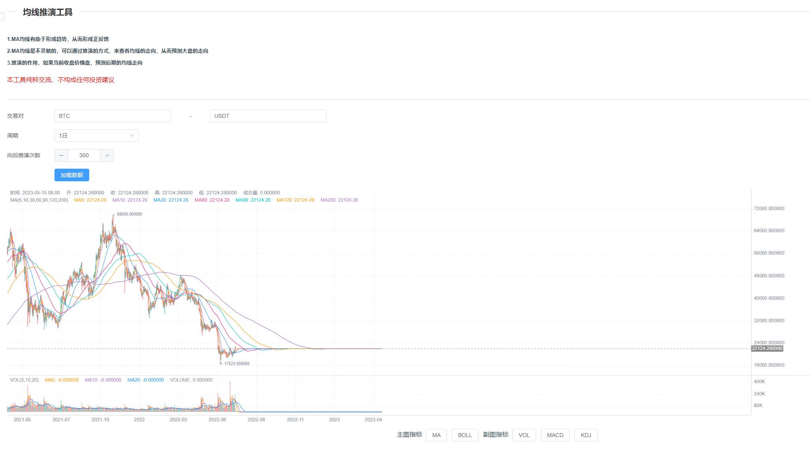

# 指标工具

[访问链接](https://lihang941.github.io/my-index-tool/)

# 集成一些指标的工具

## 推演功能

[访问链接](https://lihang941.github.io/my-index-tool/)

#### 原理

均线具有粘性，所有的价格最后都会回归均线。  

#### 作用

集成MA均线,BOLL,MACD 的推演    
推演有助于观察抵扣价以及后期趋势的形成   
推演有助于观察趋势,一旦形成趋势，就会形成正反馈，从而达到一个顶点  

## ~~LPPL (泡沫指数) 待实现~~ 

